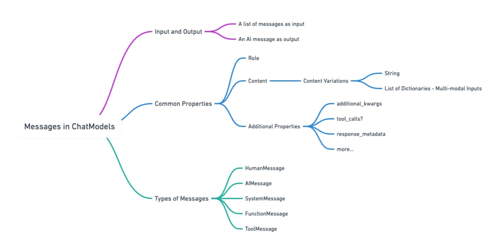

# Code Snippets for Azure OpenAI + LangChain Cookbook

A space for the team to share code snippets for collaboration

## Setup
### Installing and Importing Dependencies
-   Microsoft [recommend](https://github.com/microsoft/vscode-jupyter/wiki/Installing-Python-packages-in-Jupyter-Notebooks) to use %pip for installing for vscode .ipynb
    ```python
    %pip install -Uq langchain langchain_openai
    ```


### Set all required Environment Variables
-   `AZURE_OPENAI_API_KEY` etc instead for the prefix maybe?


## Creating a Chat Model
### (Intro section)
-   LangChain's AzureChatOpenAI Info  [Integration Overview](https://python.langchain.com/v0.2/docs/integrations/chat/azure_chat_openai/) | [API Reference](https://api.python.langchain.com/en/latest/chat_models/langchain_openai.chat_models.azure.AzureChatOpenAI.html)

-   LangChain compatible chat models take a list of `messages` as `input` and returns the AI message as `output`. 
-   All messages have a `role`, `content` common properties. Additional provider-specific information can be incomporated using the `Additional Properties`.  
  
    


### Instantiation
-   Instantiate the model with `AzureChatOpenAI` to connect to Azure OpenAI chat service.


### Prompting
-   Prompts are the inputs to language models, refined from raw user inputs to be ready for processing by the models.
-   [Prompting](https://www.datacamp.com/tutorial/prompt-engineering-with-langchain) involves crafting text inputs that clearly communicate with the models outlining the specific task we want it to accomplish.  
This can include:
    - selecting the appropriate wording and setting a particular tone or style,
    - providing necessary context
    - assigning a role to it, such as asking it to respond as if it were a native speaker of a certain language.
-   `PromptTemplate` is used to create an instance of [prompt](https://python.langchain.com/v0.1/docs/expression_language/get_started/#1-prompt) and this is `invoked` by sending this to a model and this produces a `PromptValue`.


#### Assigning Roles Using LangChain Messages
-   Compared to hardcoding the roles, it allows for more flexibility and better management especially with complex conversations with multiple roles involved. It also simplifies the visualization of the conversation flow.
-   Basic Message Types 

    |             |          |
    |-------------|----------|
    | SystemMessage | Set how the AI should behave (appropriate wording, tone, style etc) |
    | HumanMessage | Message sent from the user |
    | AIMessage | Message from the AI chat model (context setting, guidance for response) |  
      
    for more info [Message Types](https://python.langchain.com/v0.1/docs/modules/model_io/chat/message_types/) | [API Reference](https://api.python.langchain.com/en/latest/core_api_reference.html#module-langchain_core.messages) 


#### Prompt Templates
-   LangChain offer developers to design parameterised [prompt templates](https://python.langchain.com/v0.1/docs/modules/model_io/prompts/quick_start/) that is reusable and easilly transferrable between different models for integration.
-   It takes user input and transform to the final format of string or messages to feed into the language models.

-   `PromptTemplate`  
    The example code uses `.from_template` which handles a single string template with placeholders for dynamic inputs.
    ```python
    from langchain_core.prompts import PromptTemplate  

    prompt_template = PromptTemplate.from_template(
        "What vege crops can I grow in {month} in {city}, New Zealand?"
    )
    
    prompt_value = prompt_template.format(month = "December", city = "Rotorua")
    
    print(prompt_template)
    print(prompt_value)
    ```

    ```python
    response = model.invoke(prompt_value)
    print(response.content)
    ```

-   `ChatPromptTemplate`  
    It is optimised for conversation like format. The prompt is a list of chat messages. Each chat message is associated with `role` and `content`. In the example code `.from_messages` is used to include multiple messgaes.

    ```python
    from langchain_core.prompts import ChatPromptTemplate

    chat_template = ChatPromptTemplate.from_messages(
        [
            ("system", """
                        You are a travel agent helping customers plan their trips.
                        Recommend them regarding popular Accommodation, Food and Activities of the country customer is asking.
                        """), 
            ("ai", "Hi there, What can I help you with today?"),
            ("human", "Hi I'm {name}, I'm planning a trip to {country}. Any recommendations")
        ]
    )

    prompt_value = chat_template.format_messages(name="Lucy", country="New Zealand")
    
    print(chat_template)
    print(prompt_value)
    ```

    ```python
    response = model.invoke(prompt_value)
    print(response.content)
    ```
    We can also pass the `base message` or `MessagePromptTemplate` instead of the tuples
    ```python
    from langchain_core.messages import SystemMessage
    from langchain_core.prompts import HumanMessagePromptTemplate

    chat_template = ChatPromptTemplate.from_messages(
        [
            SystemMessage(
                content=("You are a translator. You are to translate the text into English."
                )
            ),
            HumanMessagePromptTemplate.from_template("{text}"),
        ]
    )

    prompt_value = chat_template.format_messages(text="アサヒスーパードライは日本のビールのです。")
    
    print(chat_template)
    print(prompt_value)
    ```

    ```python
    response = model.invoke(prompt_value)
    print(response.content)
    ```


-  `MessagePlaceHolder`  
    It is used to select which messages to include when formatting.

    ```python
    from langchain_core.prompts import (
        HumanMessagePromptTemplate,
        SystemMessagePromptTemplate,
        ChatPromptTemplate,
        MessagesPlaceholder,
        AIMessagePromptTemplate,
    )

    system_template = SystemMessagePromptTemplate.from_template("""
                                                You are a precise assistant who knows the shcedule of the team.
                                                Schedule details are as follows: {schedule}.
                                                Only provide information to the team members.
                                                Strictly only provide information specific to what is asked, Do not give extra information.
                                                """)
    human_template = HumanMessagePromptTemplate.from_template("My name is {user_name}.")
    ai_template = AIMessagePromptTemplate.from_template("Hello {user_name}, how can I help you today?")

    chat_prompt = ChatPromptTemplate.from_messages(
        [
            system_template,
            human_template,
            ai_template,
            MessagesPlaceholder(variable_name="conversation"), 
        ]
    )

    chat_prompt
    ```
    
    ```python
    from langchain_core.messages import HumanMessage, AIMessage

    schedule = """
        Team Members: Alice, Bob, Carol, David, Emily
        Team Meeting Schedule: Every Tuesday at 11:00 AM
        Topic: LangChain with Azure OpenAI Integration
    """

    human_query = HumanMessage("When is the next team meeting and who are attending?")
    ai_message = AIMessage("Hold on a second, let me check the schedule for you.")

    prompt_value = chat_prompt.format_messages(
        conversation=[human_query, ai_message], user_name="David", schedule=schedule
    )

    prompt_value
    ```

    ```python
    response = model.invoke(prompt_value)
    print(response.content)
    ```

-   `FewShotPrompt`
    We can use examples(shots) to condition the model for better response by including some example input and output in the prompts. It will tell the model about the context and how we want the output to look like.  
    
    Basic example
    ```python
    from langchain_core.prompts import FewShotPromptTemplate

    examples = [
        {"input": "one dollar", "output": "$1"},
        {"input": "thirty five euros", "output": "€35"},
    ]

    example_prompt = PromptTemplate(
        input_variables=["input", "output"], template="Currency Unit Conversion: [Input] {input} => [Output] {output}"
    )

    # unpack the first example dictionary and feed it to the prompt template to format
    print(example_prompt.format(**examples[0]))

    # feed examples to FewShotPromptTemplate to generate a final prompt
    fewshot_prompt = FewShotPromptTemplate(
        examples=examples,
        example_prompt=example_prompt,
        suffix= "Convert the currency units: {input}",
        input_variables=["input"],
    )

    prompt_value= fewshot_prompt.format(input="one hund yen")

    response = model.invoke(prompt_value)
    print(response.content)
    ```


### Chaining
-   Many LangChain components implement the [**Runnable**](https://python.langchain.com/v0.2/docs/concepts/#runnable-interface) protocol which allows them to be easily chained together. These components can be combined together in a sequence of calls which we call them a chain.

-   Chaining `Runnables` in sequence

    ```python
    from langchain_core.prompts import SystemMessagePromptTemplate, ChatPromptTemplate

    system_template = SystemMessagePromptTemplate.from_template("""
            You are an expert in {country} cuisine. 
            Keep it simple and short.
        """)

    chat_prompt = ChatPromptTemplate.from_messages(
        [
            system_template,
            ("human", "I'd like to find out about {country} cuisine."),
            ("human", "{question}"),
        ]
    )
    ```
    We will skip this step and invoke using the chain.
    ```python
    prompt_value = chat_prompt.format_messages(country="Japanese", question="What is the most popular Sashimi in Japan vs the rest of the world?")
    
    response = model.invoke(prompt_value)
    print(response.content)
    ```
    
    Create a chain of sequences instead and invoke it all together. `StrOutputParser` is also chained to convert the output from the model to an easilly readible string.
    ```python
    from langchain_core.output_parsers import StrOutputParser

    chain = chat_prompt | model | StrOutputParser()

    print(
        chain.invoke(
            {
                "country": "Japanese", 
                "question": "What is the most popular Sashimi in Japan vs the rest of the world?"
            }
        )
    )
    ```

Agents
Tools
Retrieval 
Model I/O Output parsers

examples